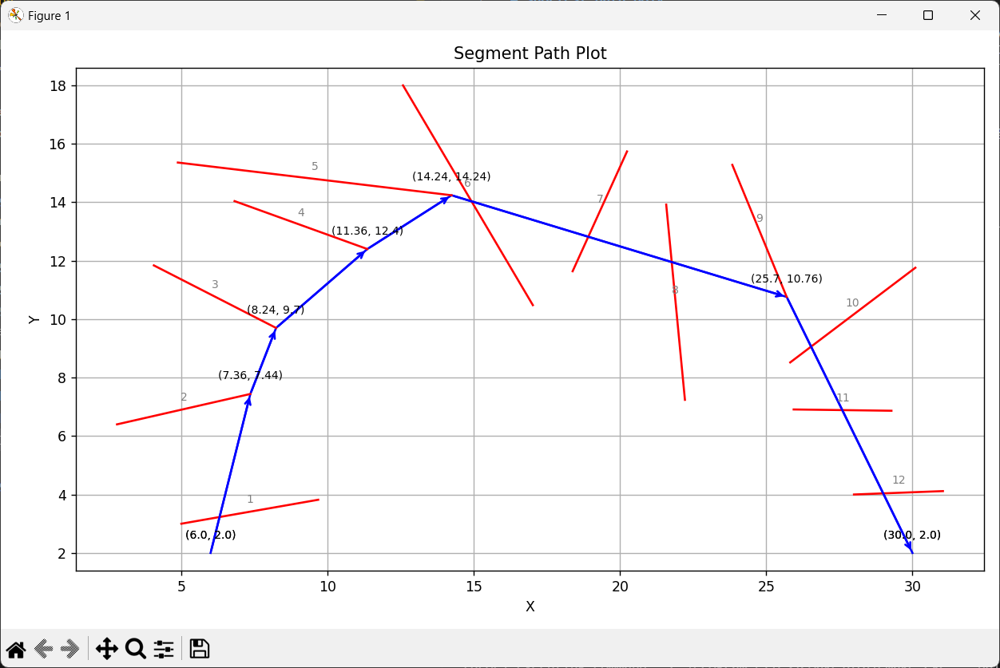

# shortest-path-poly

[](https://github.com/leberechtreinhold/shortest-path-poly/actions/workflows/ci.yml)

This projects calculates a path between points crossing a bunch of segments (basically, traversing a triangulated polygon). Currently the algorithm implemented is funnel.

# Running

    shortest-path-poly.exe --input=test/data/basic_route.json --verbose --output=result.json
    python visualizer/show_route.py --input result.json



# Building

```sh
cmake --preset=dev
cmake --build --preset=dev
```

